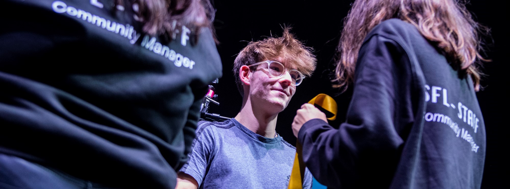

#  **Hi, my name is Alvaro Cordero** 👋

### Web application development student 

I'm a first year Web Application Development student.

I'm 18 years old, now I am training in the institute IES Los Sauces (Benavente, Zamora). Right now I am dedicated to listening and learning any type of methodology, language or field that I am taught.

I have many projects in mind and I am already working on several of them.

## Technologies:

> I am currently specializing in all these technologies as well as learning many new ones.

## Find me on:

+ [**TWITTER**](https://twitter.com/KokeRL_)
+ [**LINKEDIN**](https://www.linkedin.com/in/%C3%A1lvaro-cordero-mi%C3%B1ambres-2a1893233/)
+ [**LINK SITE**](https://alvarocormi.000webhostapp.com/)

> You can find me better in these apps
  

 

## Contact

